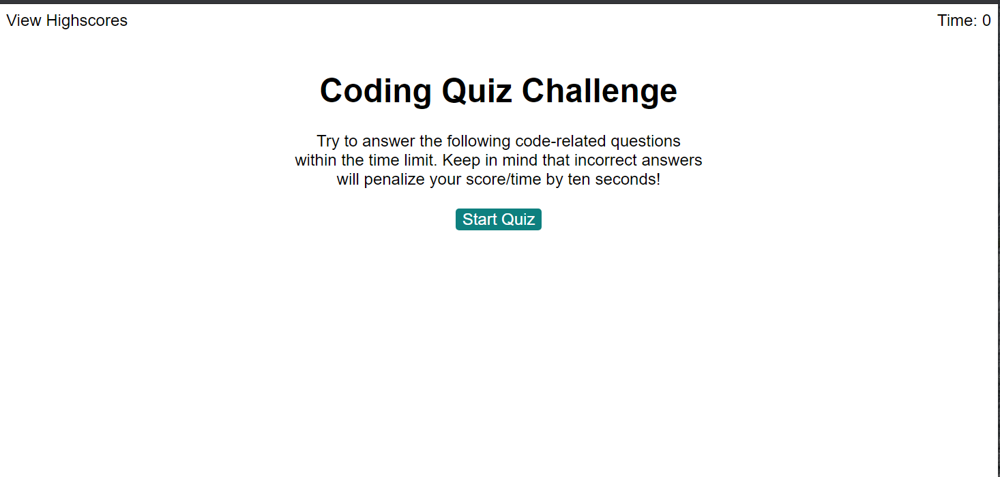
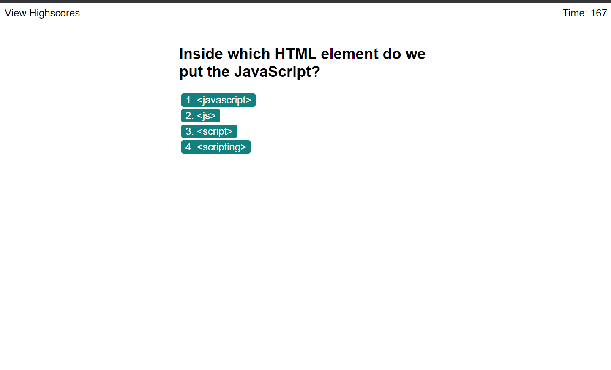
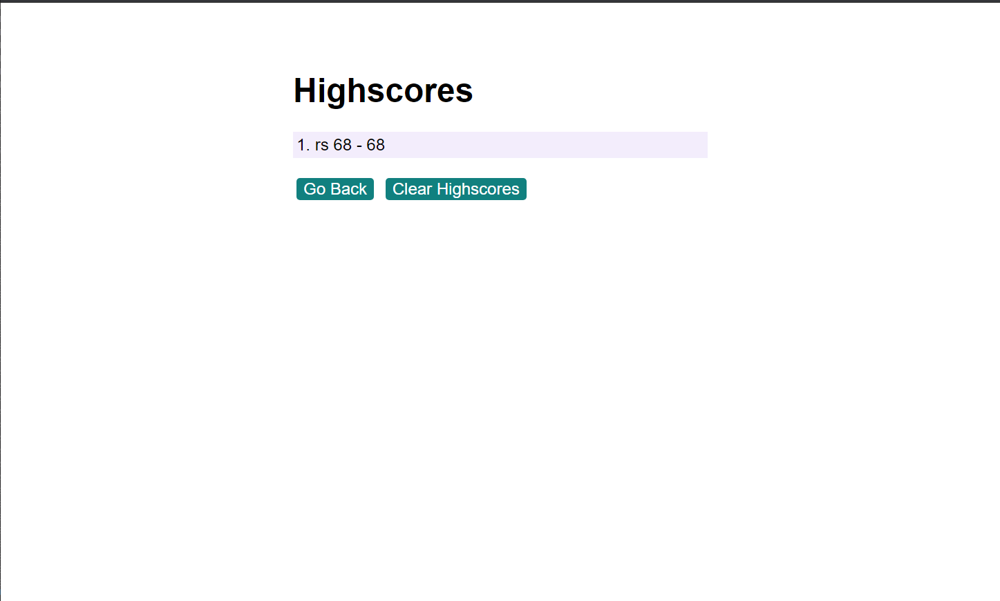

## Homework assignment #4 - Web APIs: Code Quiz

## Task

We were tasked to to create a quiz where correct and incorrect answers would buy or take away time from the quiz. The final time would be your score based on how much time you had left.

The main object to this assignment is to have us create javascripts that would: 

* Make questions and answer arrays
* Generate for each loops.
* Use local storage to store past scores.
* a timer function that will be used for highscore.


## Screenshot Example





## Github repository
https://robertsantos-dfw.github.io/04-Homework/.


## User Story

```
AS A coding boot camp student
I WANT to take a timed quiz on JavaScript fundamentals that stores high scores
SO THAT I can gauge my progress compared to my peers
```

## Acceptance Criteria

```
GIVEN I am taking a code quiz
WHEN I click the start button
THEN a timer starts and I am presented with a question
WHEN I answer a question
THEN I am presented with another question
WHEN I answer a question incorrectly
THEN time is subtracted from the clock
WHEN all questions are answered or the timer reaches 0
THEN the game is over
WHEN the game is over
THEN I can save my initials and score
```


## Github repository
https://robertsantos-dfw.github.io/04-Homework/.


## User Story

```
AS A coding boot camp student
I WANT to take a timed quiz on JavaScript fundamentals that stores high scores
SO THAT I can gauge my progress compared to my peers
```

## Acceptance Criteria

```
GIVEN I am taking a code quiz
WHEN I click the start button
THEN a timer starts and I am presented with a question
WHEN I answer a question
THEN I am presented with another question
WHEN I answer a question incorrectly
THEN time is subtracted from the clock
WHEN all questions are answered or the timer reaches 0
THEN the game is over
WHEN the game is over
THEN I can save my initials and score
```
